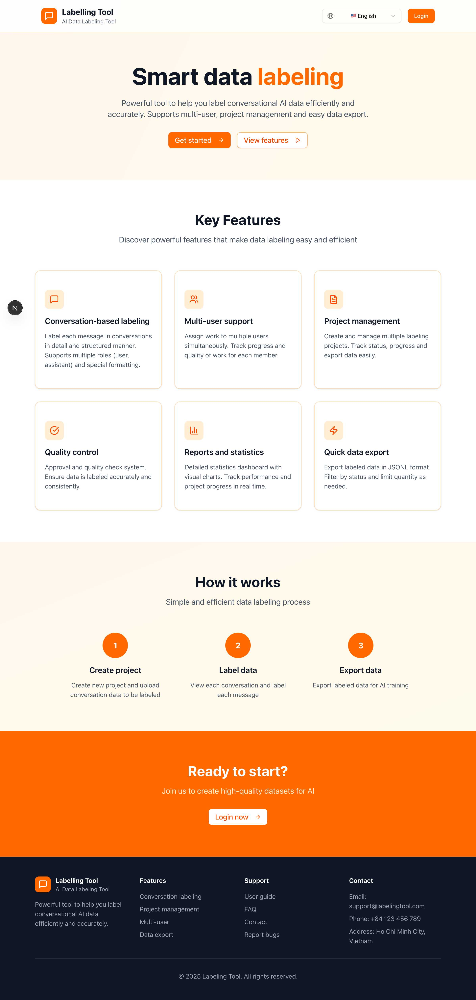
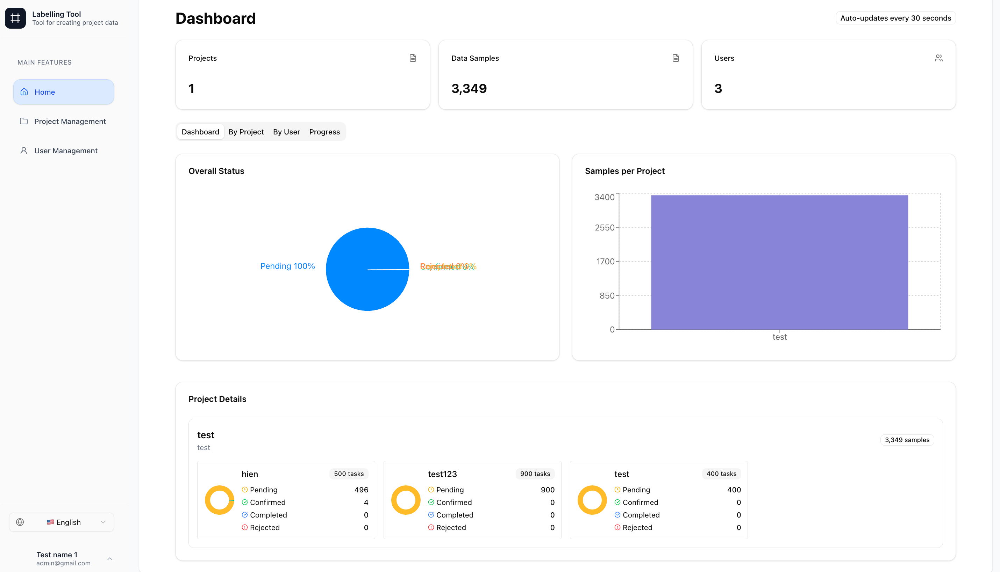
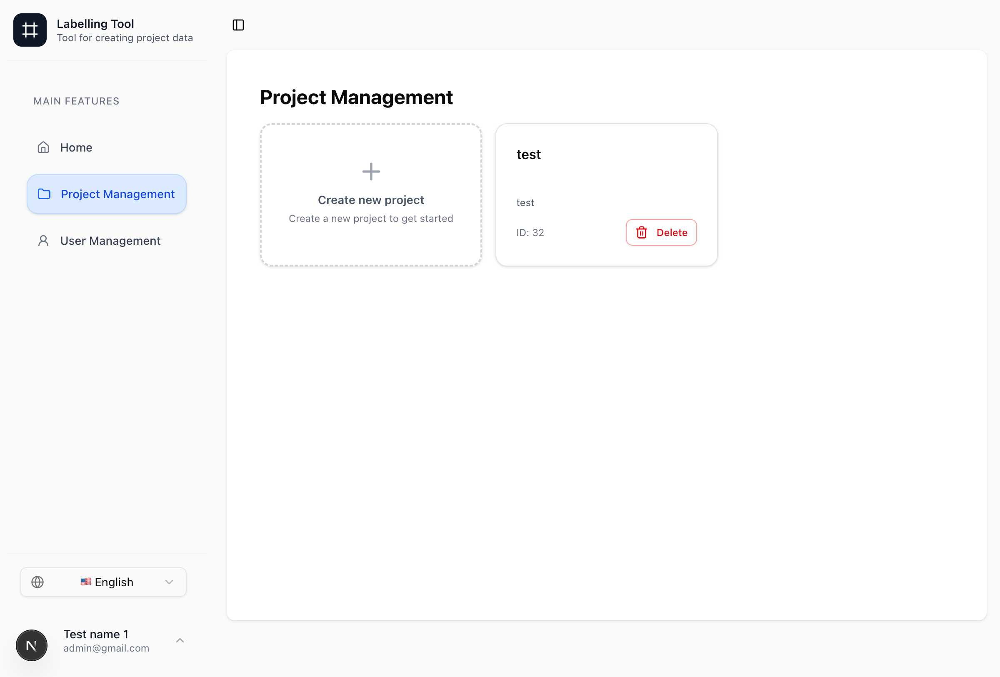
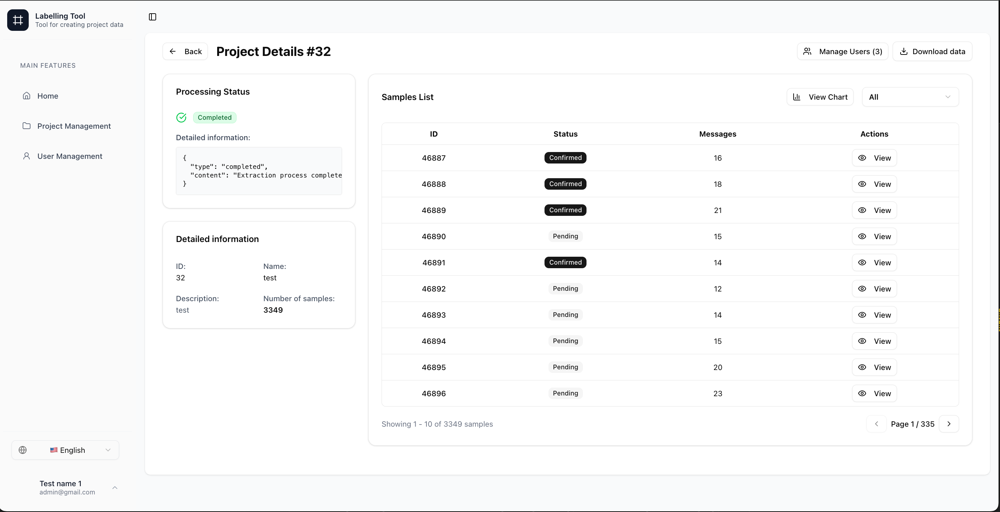
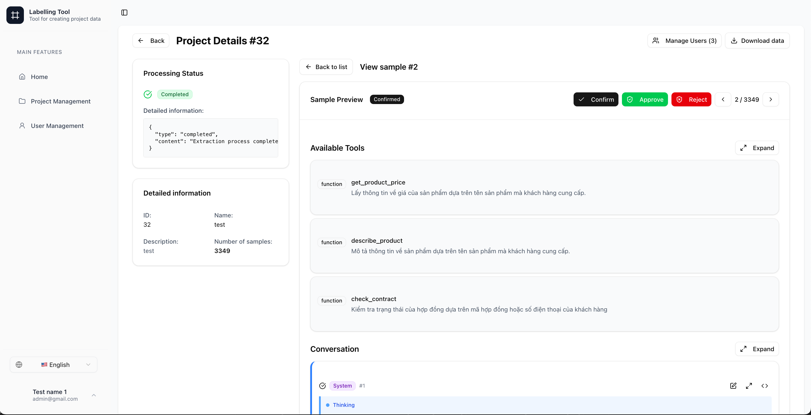
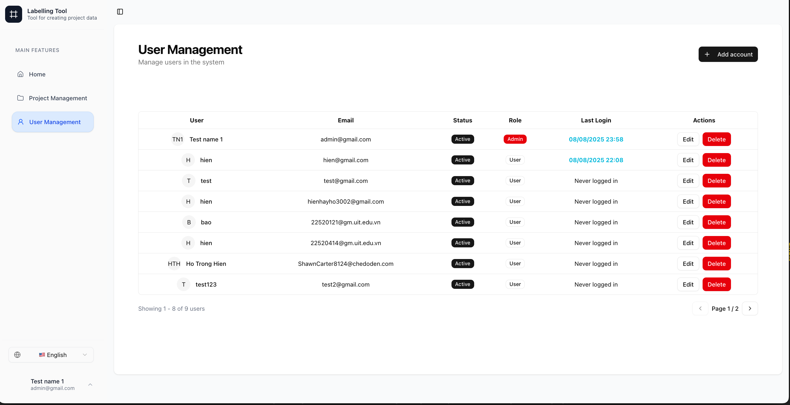

# 🏷️ Conversational Labeling Tool

A powerful AI data labeling tool designed for conversational data annotation. This tool supports multi-user collaboration, project management, and easy data export for AI training purposes.

## ✨ Features

- 💬 **Conversation-based labeling**: Label each message in conversations with detailed and structured annotations
- 👥 **Multi-user support**: Assign work to multiple users simultaneously and track progress
- 📁 **Project management**: Create and manage multiple labeling projects with status tracking
- ✅ **Quality control**: Built-in approval and quality check system
- 📊 **Real-time statistics**: Dashboard with visual charts to track performance and progress
- 📤 **Quick data export**: Export labeled data in JSONL format with filtering options
- 🌐 **Multi-language support**: Available in English, French, Japanese, Vietnamese, and Chinese

## 📸 Screenshots

### Landing Page



### Dashboard



### Project Management



### Project Details



### Sample Labeling Interface



### User Management



## 🚀 Quickstart

**Run:**

```bash
chmod +x start-production.sh

bash start-production.sh
```

You can now access the application at [http://localhost](http://localhost).

**Default Admin Credentials:**

- 📧 Email: `admin@gmail.com`
- 🔑 Password: `admin123`

**(Optional)** Modify `DOMAIN`, `BACKEND_CORS_ORIGINS`, `NEXT_PUBLIC_API_URL` to your domain in [.env.production](./.env.production).

## 🛠️ Tech Stack

- 🐍 **Backend**: FastAPI (Python) with Celery for background tasks
- ⚛️ **Frontend**: Next.js 15 with TypeScript and Tailwind CSS
- 🗄️ **Database**: MySQL
- 💾 **Cache**: Redis
- 🐳 **Containerization**: Docker with Docker Compose
- 🔀 **API Gateway**: Traefik (for production)

## 💻 Development Setup

```bash
pre-commit install

make database_up

cp .env.example .env
```

### Backend

```bash
cd backend && uv sync

uv run alembic upgrade head

uv run fastapi run --reload app/main.py
```

### Celery

```bash
cd backend/

uv run celery -A app.celery_app worker --loglevel=info
```

### Frontend

```bash
cp .env.example ./frontend/.env

cd frontend/

pnpm i --frozen-lockfile

pnpm build && pnpm start
```

## 📄 License

This project is licensed under the MIT License - see the [LICENSE](LICENSE) file for details.
